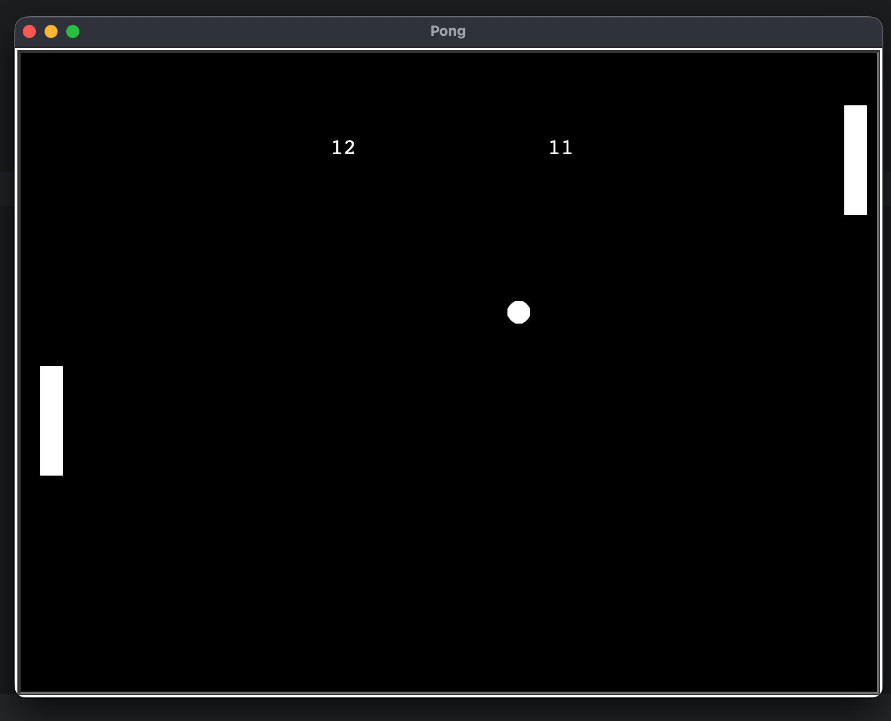

# Pong Game in Python

A classic implementation of the arcade game Pong, built with Python's Turtle module. This project was created as part of my learning journey through Dr. Angela Yu's "100 Days of Code" bootcamp.

## About The Project

This project demonstrates the principles of object-oriented programming and event handling in Python. It features two paddles controlled by the players, a ball that bounces off the walls and paddles, and a scoring system to keep track of the winner.

## Screenshot



## Requirements

*   Python 3.x

## How to Play

1.  **Clone the repository:**
    ```bash
    git clone https://github.com/dheerajdhami2001-cyber/pong-game.git
    ```
2.  **Navigate to the project directory:**
    ```bash
    cd pong-game
    ```
3.  **Run the game:**
    ```bash
    python main.py
    ```

## Controls

*   **Left Paddle:** Use the 'W' (up) and 'S' (down) keys.
*   **Right Paddle:** Use the Up Arrow and Down Arrow keys.

## Acknowledgments

*   This project was inspired by and completed with the guidance of the **[100 Days of Code: The Complete Python Pro Bootcamp](https://www.udemy.com/course/100-days-of-code/)** by Dr. Angela Yu.A huge thank you to her for the excellent instruction and comprehensive course material.
