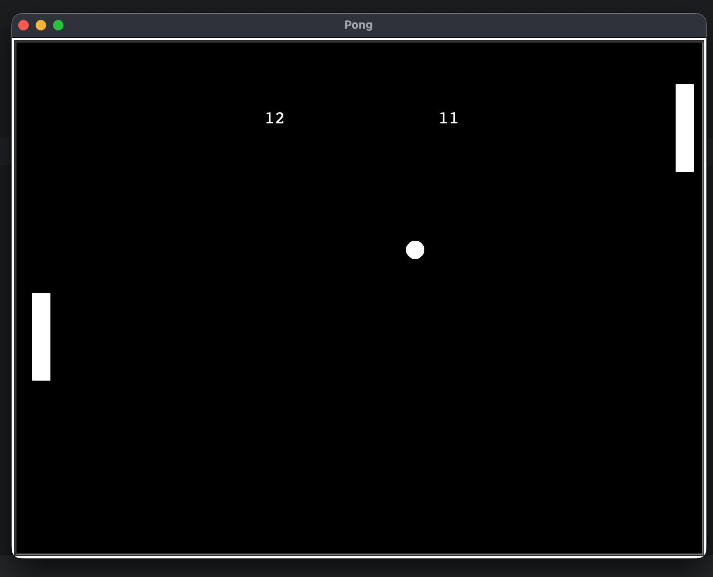

Pong Game

A classic implementation of the arcade game "Pong" created using Python's Turtle graphics library. This project was built as part of the "100 Days of Code: The Complete Python Pro Bootcamp" course on Udemy.

Description

This is a two-player Pong game where each player controls a paddle to hit a ball back and forth. The objective is to score points by making the ball pass the opponent's paddle. The first player to miss the ball concedes a point to the other.

Features

Two-Player Gameplay: Compete against a friend on the same keyboard.

Score Tracking: The game keeps track of the score for each player, displayed at the top of the screen.

Increasing Difficulty: The ball's speed increases slightly each time it is hit by a paddle, making the game more challenging over time.

Simple Controls: Easy-to-learn controls for intuitive gameplay.

How to Play

Make sure you have Python installed on your computer.

Download all the project files (main.py, ball.py, paddle.py, scoreboard.py).

Run the main.py file from your terminal: python main.py

Controls:

Left Paddle (Player 1): Use the 'W' key to move up and the 'S' key to move down.

Right Paddle (Player 2): Use the 'Up Arrow' key to move up and the 'Down Arrow' key to move down.

Technologies Used

Python 3

Turtle Graphics Library

Acknowledgments

This project was inspired by and completed as part of the curriculum in Dr. Angela Yu's "100 Days of Code: The Complete Python Pro Bootcamp" on Udemy. A big thank you to her for the excellent instruction and guidance.
